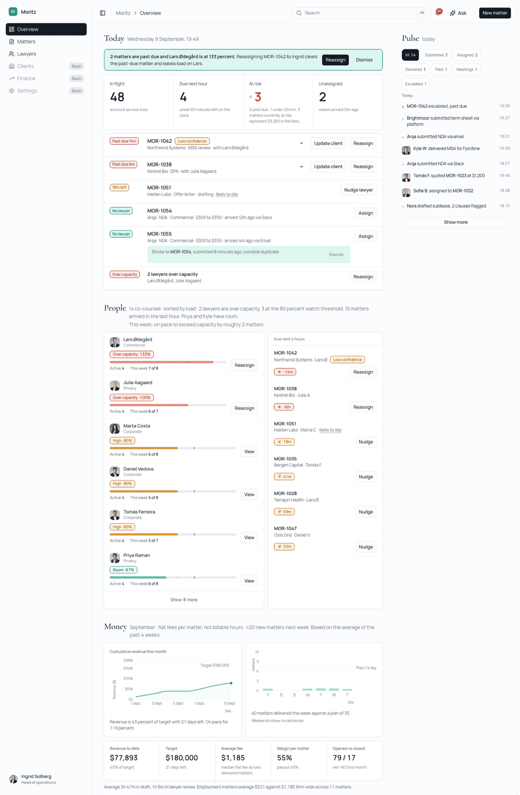
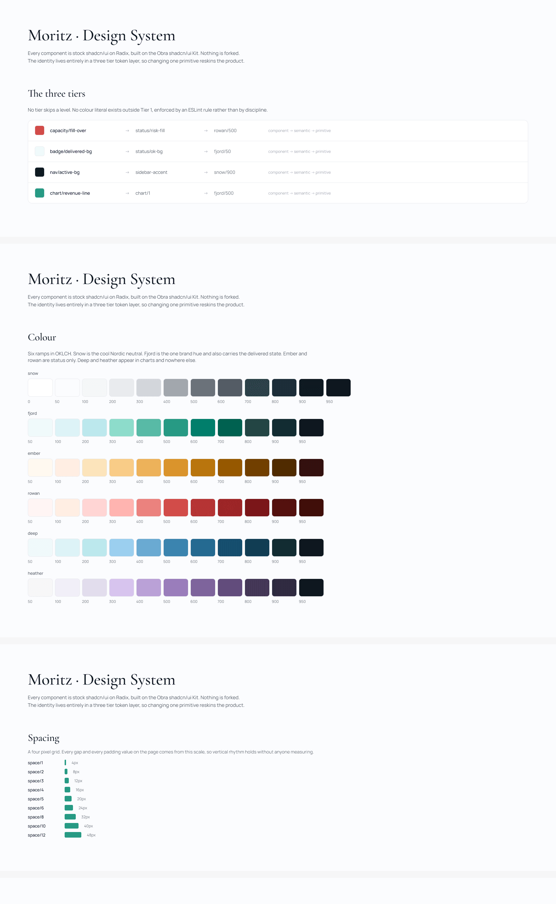
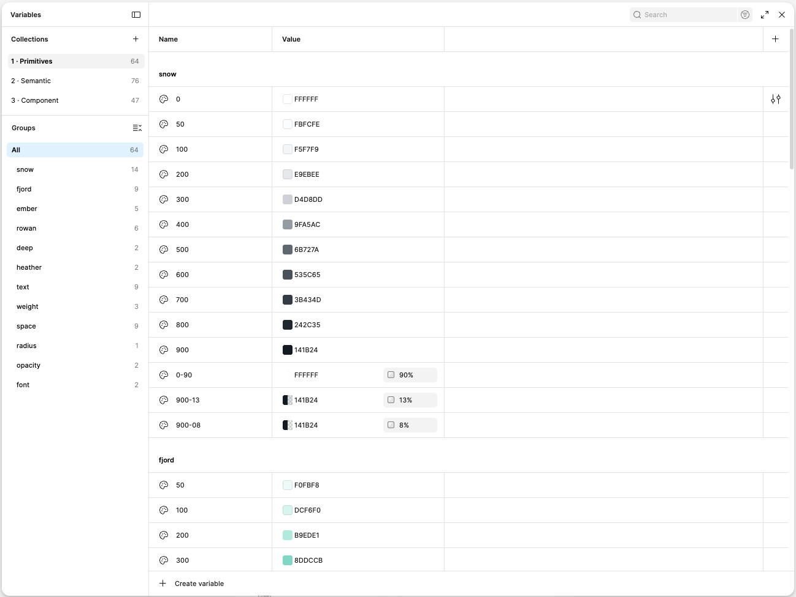
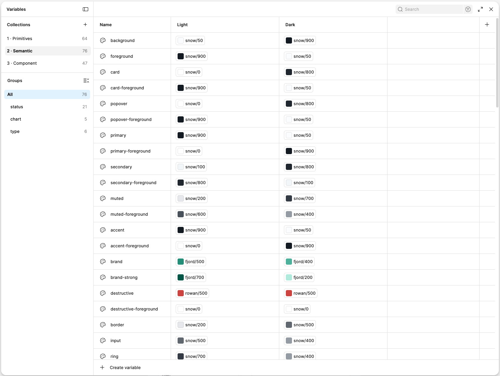
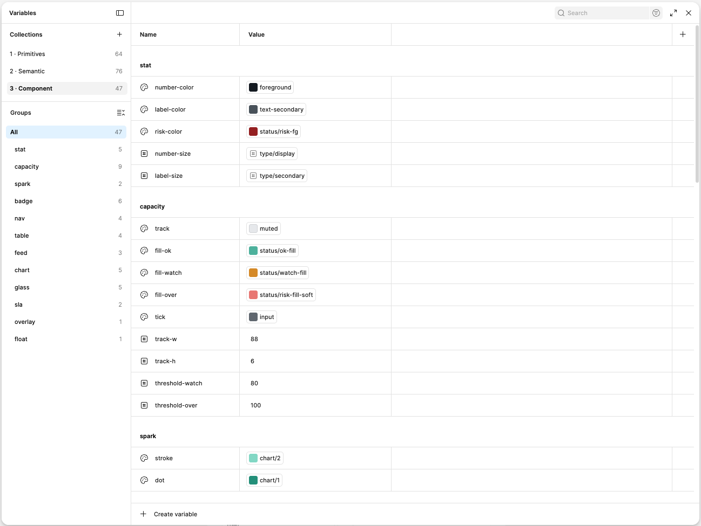
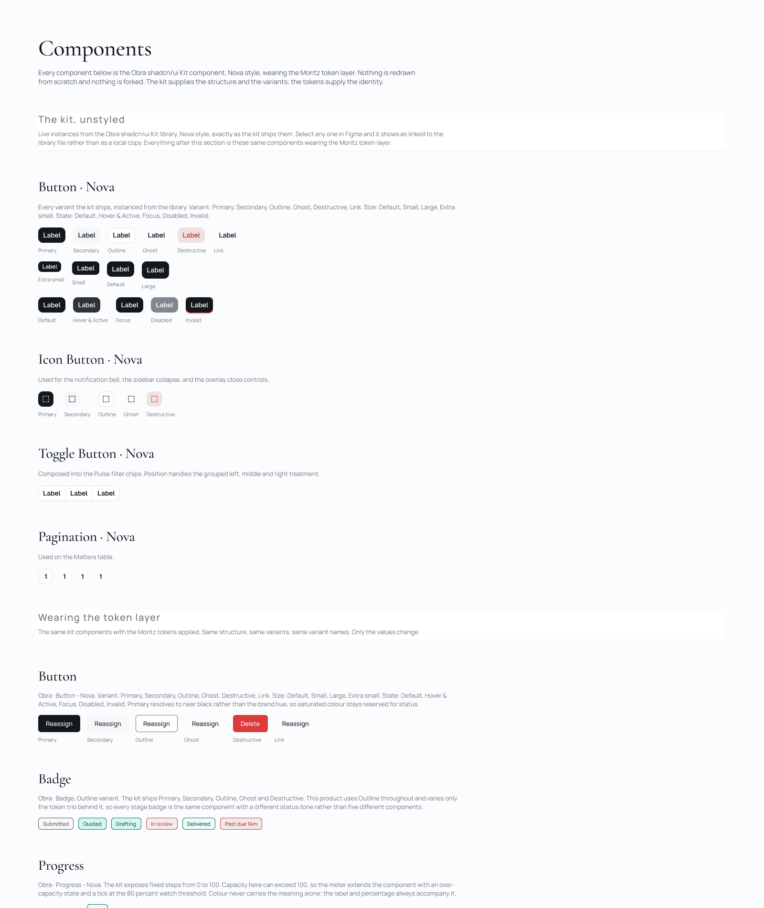
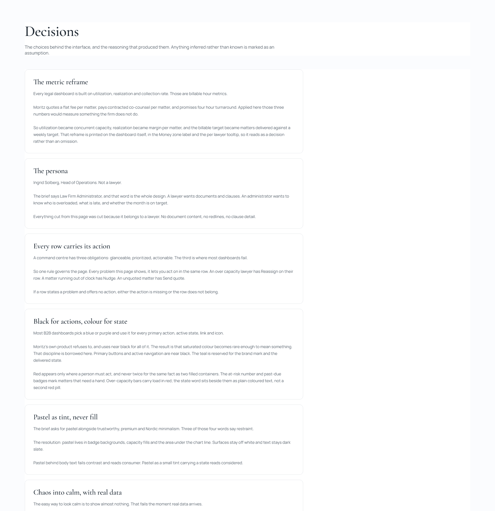

<p align="center">
  
</p>

<h1 align="center">Moritz Operations Dashboard</h1>

<p align="center">
  <strong>A single-page command center for a Law Firm Administrator at Moritz, an AI-native law firm.</strong>
</p>

<p align="center">
  Built as a design assessment. The brief asked for a dashboard that is trustworthy, premium,<br />
  Nordic-minimal, and pastel, serving a Law Firm Administrator managing case flow, capacity, and revenue.
</p>

<p align="center">
  <a href="https://moritz-admin.vercel.app"><strong>Live application</strong></a>
  ·
  <a href="https://www.figma.com/design/wCNR8r9BTCy2OiFeniCgQQ/Moritz--assessment"><strong>Figma design system</strong></a>
  ·
  <a href="./docs/design-system.md">Design system notes</a>
  ·
  <a href="./UX-SPEC.md">UX specification</a>
</p>

<p align="center">
  
  
  
  
  
</p>

<p align="center">
  
</p>

---

## ✨ At a Glance

- **One command-center page** balancing firm health, workload, and financial performance
- **19 AI surfaces** under one actor (Nora), with streaming drafts and a data-scoped Ask panel
- **Realtime collaboration** through Supabase on `matters` and `activity`
- **Relative-time seeding** so the four-hour clock stays correct whenever a reviewer opens the link
- **Token-enforced design system** with Figma Foundations, Tokens, Components, Screens, and Decisions documented below

## 🧭 Contents

- [Stack](#-stack)
- [Five Minutes](#️-five-minutes)
- [The One Decision That Shaped Everything](#️-the-one-decision-that-shaped-everything)
- [The Persona](#-the-persona)
- [Information Architecture](#️-information-architecture)
- [Design System](#-design-system)
- [The Figma File](#-the-figma-file)
- [Backend](#️-backend)
- [Relative Time](#-relative-time)
- [AI: Nineteen Surfaces, One Rule Set](#-ai-nineteen-surfaces-one-rule-set)
- [Frontend](#️-frontend)
- [Accessibility](#-accessibility)
- [Mobile](#-mobile)
- [How This Was Actually Built](#️-how-this-was-actually-built)
- [Out of Scope, and Why](#-out-of-scope-and-why)
- [Assumptions](#-assumptions)
- [Running Locally](#-running-locally)
- [What I'd Build Next](#️-what-id-build-next)

---

## 🧰 Stack

`Next.js 16` · `TypeScript` · `Tailwind CSS v4` · `Supabase` ·
`Google Gemini` · `Framer Motion` · `Tiptap` · `TanStack Query` ·
`TanStack Table` · `Recharts` · `shadcn/ui` · `Vercel`

> Supabase powers PostgreSQL, Realtime, and RLS. Gemini powers Ask and client-update drafting through server-only API routes.

---

## ⏱️ Five Minutes

If you have five minutes, this is the order that makes the most sense.

1. **[Open the live app](https://moritz-admin.vercel.app).** The Overview is the submission. Look at it for two seconds, then look away, and see whether you can name what needs attention. That test drove the entire information architecture.
2. **Act on something.** Every row that states a problem carries the action that resolves it. Reassign a past-due matter and watch the Pulse feed on the right pick it up, that feed is written by a database trigger rather than a second client call.
3. **Press Cmd+K, then Cmd+J.** The command palette and the assistant. Ask who can take a commercial matter in the next hour; the answer names real lawyers and each one carries a working Assign button.
4. **Open it on a phone.** Navigation becomes a bottom bar rather than a drawer. The zones stack in the same order as desktop, Today then People then Money, and Pulse is its own destination in that bar. Tables become cards; both Money charts stay on the page, just shorter.
5. **[Open the Figma file](https://www.figma.com/design/wCNR8r9BTCy2OiFeniCgQQ/Moritz--assessment).** Five pages: Foundations, Tokens, Components, Screens, and Decisions.

---

## ⚖️ The One Decision That Shaped Everything

Moritz doesn't bill by the hour. They quote a flat fee per matter, pay contracted co-counsel per matter, and promise a four-hour average turnaround on complex commercial work.

Almost every legal dashboard on the market is built around utilization rate, realization rate, and collection rate, which are billable-hour metrics. Applied here, they'd measure something the firm doesn't do.

So the metrics were reframed:

| Standard legal metric | What it becomes here | Why |
|---|---|---|
| Utilization rate | Concurrent capacity | Co-counsel hold matters, they don't fill timesheets |
| Realization rate | Margin per matter | Fee minus payout, not billed minus worked |
| Billable target | Matters delivered vs. weekly target | The unit of work is the matter |
| Work in progress | Matters in flight against the clock | The four-hour clock is the constraint |

That reframe is printed on the dashboard itself, in the Money zone label and in the per-lawyer tooltip, so it reads as a deliberate decision rather than an omission.

---

## 👤 The Persona

Ingrid Solberg, Head of Operations. Not a lawyer.

She routes incoming matters to contracted co-counsel, watches the four-hour clock across everything in flight, and owns flat-fee margin. She opens this page asking three questions, in order:

1. Is anything about to breach?
2. Who has room?
3. Are we on target this month?

Every element on the page answers one of those three. Anything that answered none of them was cut, which is why there's no document content, no redlines, and no clause-level detail here. Those belong to the lawyer, not the administrator.

---

## 🗺️ Information Architecture

The brief asked for a "command center." That word carries three obligations:

**Glanceable.** State of the firm reads in seconds, without clicking.
**Prioritized.** The alarming thing is louder than the routine thing.
**Actionable.** You act from it, you don't just look at it.

The third is where most dashboards fail, so one rule governs the whole page:

> Every problem this page shows, it lets you act on in the same row.

An over-capacity lawyer has Reassign on their row. A matter running out of clock has Nudge. An unquoted matter has Send quote. If a row states a problem and offers no action, either the action is missing or the row doesn't belong on this page.

### Three tiers of urgency

| Tier | Contents | Desktop | Mobile |
|---|---|---|---|
| Act now | Past due, under 20 min, unassigned, over capacity | Above the fold | Above the fold |
| Watch today | Co-counsel load, deadlines, turnaround | No scrolling needed | Scroll to People |
| Context | Revenue, margin, activity | Below or in the rail | Scroll to Money; Pulse via bottom nav |

### Three zones plus a rail

The brief asked the page to balance firm health, workload distribution, and financial performance. Those three nouns became the three zones.

- **Today** — firm health. Four numbers, the morning brief, the attention list.
- **People** — workload. Co-counsel sorted by load, deadlines ranked by minutes remaining.
- **Money** — financial performance. Two charts, each saying one thing, each with a caption.
- **Pulse** — the rail on wide screens. Below 1200px it leaves the Overview and becomes its own destination in the bottom navigation.

Balance means equal completeness, not equal prominence. Urgency still orders them, so Today is loudest and Money is quietest, but every zone has a label, a primary display, and at least one action.

### Chaos into calm

The brief's phrase was "turning legal chaos into organized calm." The easy way to look calm is to show almost nothing, which fails the moment real data arrives.

So the demo state is deliberately busy: 48 matters, 14 lawyers, nineteen AI surfaces, a live feed. Calm comes from hierarchy, not emptiness.

The practical rule is **no red wash**: at most three red elements on screen at any moment, the at-risk number and the breach badges. Three matters at risk means three small badges, never three red cards. Alarm is carried by position and by one number, never by area of colour.

---

## 🎨 Design System

Every component is stock shadcn/ui on Radix. Nothing is forked. The entire visual identity lives in the token layer.

### Three tiers

```text
primitives → semantic → component → UI
```

**Tier 1, primitives.** Raw values with no meaning. Six OKLCH ramps: snow (cool neutral), fjord (dimmed sea teal), ember (dusty amber), rowan (dimmed red), deep and heather (charts only). Plus type scale, spacing, radius, opacity.

**Tier 2, semantic.** shadcn's own variable names, aliasing primitives only. `--background`, `--primary`, `--destructive`, `--chart-1` through `--chart-5`, plus a status family with background, border, foreground and fill for each of ok, watch, risk, info, neutral.

**Tier 3, component.** Component-scoped tokens, aliasing semantic only. `--capacity-fill-over`, `--badge-delivered-bg`, `--sla-watch-minutes`, `--spark-stroke`, the glass group.

No tier skips a level. No colour literal exists outside Tier 1.

That last rule is **enforced by an ESLint rule**, not by discipline. Hex codes, `rgb()`, `oklch()`, and Tailwind palette classes all fail lint outside `globals.css` and the vendored shadcn primitives.

### Visual identity

| Decision | Value | Reasoning |
|---|---|---|
| Neutral | Cool snow, slightly blue | Default warm grey reads generic |
| Accent | One dimmed sea teal | Nordic without being blue; blue is the absence of a choice |
| Primary action | Black, not the accent | Reserving colour for status makes status mean more |
| Pastel | Tints only, never fills | Pastel behind body text fails contrast and reads consumer |
| Type | Editorial serif headings, neutral sans for everything functional | Borrowed from Moritz's own product |
| Radius | 8px base, pills for badges | One radius language throughout |
| Elevation | Flat, hairlines | Nordic minimalism is an honest surface |
| Motion | State change only | Nothing decorative |
| Glass | Floating surfaces only | Blur behind a table degrades contrast |

Thresholds live in tokens and a config table, not scattered in code. Capacity bands are 80 and 100 percent. The SLA is 240 minutes with a 60-minute watch band and a 20-minute attention band. Change one row in `app_config` and the whole dashboard reclassifies with no code change.

### Where the type system came from

Research into Moritz's actual live product found a distinctive pairing: a high-contrast editorial serif for all headings against a neutral grotesque for everything functional. That combination carries their entire brand identity, and it lets the rest of the interface be almost aggressively neutral without feeling like an unstyled template.

That pairing was adopted here, along with two other patterns from the same research: black as the primary action colour rather than a brand hue, and placeholder glyphs instead of blank table cells.

What was deliberately **not** adopted: their near-total absence of urgency signalling and colour-coded status. Their product is a client-facing portal where the client's job is to wait and trust. This is an internal operations tool where the administrator's entire job is triage. Removing urgency signalling to match them would have made this worse at its actual task, not more authentic.

---

## 🖼️ The Figma File

The design system is documented in Figma across five pages. It exists to show the parts that read better as a system than as a running app: the token architecture, the mapping to the Obra kit, and the reasoning behind each decision.

**[Open the Figma file](https://www.figma.com/design/wCNR8r9BTCy2OiFeniCgQQ/Moritz--assessment)**

### Foundations

Colour ramps, status tones, typography with specimens and weights, spacing, radius, elevation, surfaces, borders, opacity, and a live glass demo. The three tiers are shown resolving rather than only described.

<p align="center">
  
</p>

### Tokens

Every token in all three tiers as a visual table: primitives with swatches and hex values, semantic with light and dark swatches side by side, component with the full resolution chain shown.

Three collections, **219 variables**. Only the semantic tier carries light and dark modes, because the component tier aliases through it and does not need its own. Zero tier violations: nothing skips a level, and no colour literal exists outside the primitives.

| Collection | Modes | Count |
|---|---|---|
| Primitives | Value | 96 |
| Semantic | Light, Dark | 76 |
| Component | Value | 47 |

**Tier 1, primitives.** Raw values with no meaning attached. Six OKLCH ramps (full 50–950 scales) plus the type scale, spacing, radius and opacity stops.

<p align="center">
  
</p>

**Tier 2, semantic.** shadcn's own variable names, aliasing primitives only. This is the only tier with light and dark modes, and the only place the theme flips.

<p align="center">
  
</p>

**Tier 3, component.** Component-scoped tokens, aliasing semantic only. Single-mode by design, since the tier beneath it already carries the mode logic.

<p align="center">
  
</p>

### Components

Organised by atomic level. Every component names its Obra equivalent and the reasoning behind how it is used, followed by a map of every composite surface in the product and a section documenting the four places this product deliberately extends the kit.

<p align="center">
  
</p>

### Screens

The Screens page points at the [live application](https://moritz-admin.vercel.app) rather than duplicating it in Figma. The product is the source of truth for layout and interaction; Figma holds the system that produced it.

### Decisions

Eight cards covering the metric reframe, the persona, the every-row-carries-its-action rule, black for actions and colour for state, pastel as tint, chaos into calm, glass only where things float, and the stated assumptions.

<p align="center">
  
</p>

---

## 🗄️ Backend

### Schema

Six tables: `lawyers`, `clients`, `matters`, `activity`, `finance_days`, `app_config`.

### The derived view

`matter_status` computes everything clock-dependent in SQL, at query time:

- `submitted_at`, reconstructed for seeded rows, absolute for real ones
- `due_at`, submitted plus the SLA from `app_config`
- `minutes_remaining`, signed, so past due is negative
- `risk`, one of ok, watch, breach, done
- `margin_pct`, fee minus payout over fee

Nothing in the application decides what "late" means. Change `sla_minutes` from 240 to 180 in one row and every matter reclassifies instantly.

### The trigger

`log_matter_change` fires before update on `matters`. Reassigning writes an `assigned` activity row. Moving to delivered writes a `delivered` row. Quoting writes a `quoted` row with the fee.

The Pulse feed is therefore a consequence of the data model, not a second write from the client. Change a matter directly in the database and the feed updates in the browser.

### Row level security

Enabled on all six tables. The browser gets read policies and a single scoped update path on `matters`. Every other write goes through a route handler with the secret key, server-side.

A production deployment would scope these to the authenticated administrator. Authentication is out of scope here, so the policies are permissive by design rather than by omission.

### Realtime

`matters` and `activity` are published to the Realtime channel. A change on either invalidates both the overview query and the Matters directory query (`matters-all`), so assigning a matter in one tab updates the Overview, the Matters list, the feed, counts, and stats in another within a second.

A product whose premise is a live clock shouldn't need a manual refresh.

---

## ⏳ Relative Time

The most interesting engineering decision in this project.

**The problem.** A dashboard about a four-hour countdown is only correct relative to now. Seed it at 22:00 with two matters past due, and by Tuesday afternoon those matters are three days overdue and the page reads as a catastrophe. Nobody knows when a reviewer opens a link.

**The fix.** Seeded matters store `offset_minutes`, their distance from the viewing moment, rather than an absolute timestamp. The view reconstructs it:

```sql
case
  when m.is_seeded and m.offset_minutes is not null
    then now() - (m.offset_minutes * interval '1 minute')
  else m.submitted_at
end as effective_submitted_at
```

MOR-1042 is not "past due since 22:05." It is "past due by 14 minutes," always.

Matters created through the app carry real absolute timestamps and age normally, because those are genuine events. Only the seeded backdrop is relative.

**The test.** Run the risk query, wait ten minutes, run it again. Identical numbers.

---

## 🤖 AI: Nineteen Surfaces, One Rule Set

The AI actor is named **Nora**. She appears in the activity feed the same way any lawyer does, no badge, no special treatment, no distinct colour. She's identified as an actor, not announced as a feature.

### The rules that hold nineteen surfaces together

1. One visual treatment. Fjord tint or fjord text. No sparkles, gradients, or glow.
2. Nora's name appears sparingly, only where she's genuinely the author of something.
3. Every surface states its basis or its confidence. A suggestion without a reason is a guess with better typography.
4. Nothing acts alone. Every surface proposes; a human confirms.
5. No second path. Every action an AI surface offers is the same action that exists in the row below it.
6. Every surface has a quiet state. If it has nothing to say, it says nothing.
7. Failure is designed per surface, with a retry. Never a shared error boundary, never an infinite skeleton.
8. Never a fabricated number. If real data can't support a calculation, show an honest fallback, not a plausible-sounding invention.

### Ambient, things Nora surfaces unprompted

- **Morning brief** — connects two facts into one action ("2 matters past due and Lars is at 133 percent. Reassigning MOR-1042 to Ingrid Lie clears both") with the action attached.
- **Capacity forecast, daily** — who is already over or at the watch threshold, recent intake, and who still has room. States load from live data; it does not invent a tip-over clock.
- **Capacity forecast, weekly** — whether the week's pace exceeds total capacity before it ends.
- **Money anomaly** — flags a service line whose average fee deviates from firm-wide.
- **Predictive matter volume** — expected intake for the coming week, with its basis stated.
- **Cost of delay** — at-risk matters expressed as summed flat-fee value. Pure arithmetic on real fees, not a speculative cost model.
- **Draft / review timing (80/20)** — one Money-zone line of average minutes in draft versus lawyer review, so Moritz's 80/20 claim is a number rather than a slogan.

### Inline, at the moment of decision

- **Suggested lawyer** — one candidate marked Suggested with a stated reason: practice match, current load, on-time rate.
- **First available slot** — when nobody has room, names who frees up soonest and which matter frees them, rather than silently suggesting the least-bad option.
- **Smart triage** — an unassigned matter arrives pre-classified with service line, type, and fee band, to confirm rather than fill in.
- **Fee suggestion** — a median with its comparable count stated, editable, because the AI proposes and the human decides.
- **Slip risk** — a matter technically on time but statistically likely to breach, based on that lawyer's on-time history.
- **Draft confidence** — matters whose AI draft scored below threshold get flagged and sorted higher, because a weak draft costs more of the clock.
- **Duplicate intake catch** — flags a likely accidental double submission from the same client. Surfaces the observation, never auto-merges.
- **Explain this number** — on stats where a real top-contributor calculation is possible, reveals what's actually driving the figure.

### Generative

- **Client update draft** — streams word by word into an editable Tiptap field, not a read-only preview, so the first sentence can be corrected while the third is still arriving.
- **Escalation handoff** — context for whoever picks up an escalated matter: what was drafted, how long it took, what was flagged, and where possible, why, computed from real comparison against that matter type's history.

### Conversational

- **Ask panel** — scoped strictly to the firm's live data, rebuilt on every request so it never answers from stale state. Answers name the matters and lawyers they're based on. Critically, when an answer mentions someone with capacity or a matter needing action, it renders real action buttons underneath, so asking "who can take an employment matter" returns three names each with a working Assign button.
- **General legal information mode** — a separately labelled, clearly bounded mode for general legal concepts, with a persistent disclaimer, visually distinguished from firm-grounded answers, and hard-separated from the rest of the app's AI logic so it can never be cited as a basis for anything else.

---

## 🖥️ Frontend

**Data.** TanStack Query with a 60-second refetch and Realtime invalidation. One shared query feeds all three Overview zones and the rail; the Matters page uses its own `matters-all` query. Assign, nudge, and quote use optimistic updates with snapshot rollback so the row moves before the network returns. Create and client-update are invalidate-only: create waits on the server for a real reference and id, and client-update is a streaming generative write rather than a patchable row state.

**Tables.** TanStack Table for the capacity table and the Matters page, with real sorting and pagination.

**Charts.** Recharts through the shadcn chart wrapper, themed by the five chart tokens. Cumulative revenue against a dotted target, because the story is the gap. Matters delivered against a plan line. Each carries a caption sentence, and a chart that can't produce a sentence comes off the page.

**Motion.** A shared motion token system, one duration and one easing curve reused everywhere, so timing is consistent rather than each animation having its own personality. Roughly thirty animations, all in service of state change, spatial continuity, or loading feedback. Nothing decorative. A resolved row slides out. A changed number dips. Nothing hovers, lifts, or floats. All of it gated by `prefers-reduced-motion`.

**Editor.** Tiptap with an imperative `appendText` so streaming tokens push into the document without remounting on every chunk.

**Glass.** Floating surfaces use real `backdrop-filter` at 92 percent opacity with a 28px blur, an inset highlight and a soft shadow. The opacity is deliberately high: at 66 percent, text contrast became a moving target depending on what rendered behind the panel. No dashboard surface uses blur.

**Progressive disclosure.** Show more on three lists. Escalation handoff behind a chevron. Every stat number hides its calculation behind a tooltip. Every AI badge hides its basis behind one. On narrower screens the zones still stack in full; disclosure shortens charts and swaps tables for cards rather than hiding a zone behind a tab.

The rule throughout: **progressive disclosure hides detail, never the action.** Every level-one row carries its button.

---

## ♿ Accessibility

WCAG 2.2 AA, tested rather than assumed, and re-verified after every batch of changes.

Keyboard reachable end to end with a visible focus ring on every element. Sheets trap focus and return it to the trigger. Command palette opens on Cmd+K, closes on Escape. Every full panel has a compulsory close button in addition to Escape and click-outside.

Contrast verified on every text and background pairing in both light and dark mode, including after every token change. Failures were fixed at the token layer, never with a one-off class.

Real landmarks: `nav`, `main`, `aside`. Heading order with no level skipped. `aria-current` on the active nav item, on one element only.

Meters carry `role="meter"` with value attributes. Charts carry `role="img"` with descriptions. The assistant answer is an `aria-live` polite region. Capacity always shows a ratio (and a state badge when High or Over), never colour alone; the percentage is in the tooltip.

Minimum target sizes: 32px desktop, 44px touch.

`prefers-reduced-motion` respected throughout.

---

## 📱 Mobile

A reduction, not a squeeze. Nothing scrolls sideways. Nothing visible on desktop is absent on a narrower screen; elements adapt rather than disappear.

Navigation is a fixed bottom bar, Overview, Matters, Lawyers, Pulse, More, not a hamburger drawer. Pulse is a primary destination here rather than part of the Overview. On wide screens (≥1200px) it returns as the right rail and the bottom bar hides.

On Overview the zones stack vertically in the same order as desktop: Today, then People, then Money. The user scrolls. Today still leads with the brief, a 2×2 stat grid, and attention cards with full-width actions.

The capacity table becomes cards. Both Money charts stay visible and readable: shorter height, fewer axis ticks, shorter date labels, captions kept. Every sheet comes up from the bottom at 85vh with the same glass.

The two-second test passes at 390px too.

---

## 🛠️ How This Was Actually Built

The method mattered as much as the output.

**Research before design.** The metric reframe came from reading Moritz's site and press, not from a design instinct. Competitor dashboards (Clio, MyCase, Smokeball, PracticePanther) supplied the legal vocabulary; Float, Forecast, and Harvest supplied capacity patterns; Linear supplied the triage and feed patterns; Ramp and Mercury supplied finance density.

**Tokens in code, not Figma.** The reviewer clicks a link. Figma effort is invisible unless exported at the end.

**Schema before screens.** Fourteen lawyers, 48 live matters, 90 delivered, a month of finance, 35 activity events, all written before the first component. A dashboard designed against placeholder data looks fine and falls apart on real data.

**One change at a time.** Nothing started until the previous change was committed and verified, and every batch produced a written record with before and after evidence before the next began. That discipline is why a regression could always be traced to the change that caused it.

**Verification over assumption.** When an external audit claimed three specific bugs, each was independently verified before fixing. Two were real; one was a measurement artifact. Two later "fixed" issues turned out to need a second, different fix when the first didn't fully land, caught only because each fix was re-tested rather than assumed.

**Comparison before commitment.** Two visual directions side by side with real data beat any amount of arguing about which is better.

**Assumptions stated out loud.** Every number that couldn't be verified is documented as a hypothesis.

---

## 🚫 Out of Scope, and Why

**Authentication.** One reviewer, one page. A login screen is friction on a demo. The RLS policies are real; production would scope them to the authenticated administrator.

**Email delivery.** The client update logs an activity row and says so on the button. Faking a sent email would be a lie a reviewer could catch.

**Clients, Finance, and Settings pages.** The brief asked for a single page. Each route states what it would contain and why it isn't here. A route that explains itself reads as judgment; a 404 reads as unfinished.

**Storage, offline, PWA.** Nothing on this page needs them.

Matters and Lawyers were built, because the command palette, the filters, and the capacity table all needed somewhere real to land.

---

## 📌 Assumptions

Moritz's internal admin workflows aren't public. The persona and the model of the work are inferred from their published operating model: flat fees, contracted co-counsel, same-day turnaround, intake by email and Slack.

Stated plainly, because pretending they're facts would be worse:

- Capacity bands of 80 and 100 percent are prototype assumptions
- The four-hour SLA is theirs; the 60-minute watch window and 20-minute attention window are mine
- The monthly target and payout range are invented
- Feed event types are inferred from the published matter flow
- Draft confidence and on-time rate are modelled, not measured

In a real engagement these would be validated with the operations lead and two co-counsel before any threshold moved.

---

## 🧑‍💻 Running Locally

```bash
git clone https://github.com/iamhtk/moritz-admin.git
cd moritz-admin
bun install
cp .env.example .env.local   # fill in Supabase and Gemini keys
```

Then run the SQL files in the Supabase editor in order, `supabase/01-schema.sql`, then `supabase/relative-time.sql`, then `supabase/realtime.sql`, and seed:

```bash
bun run seed
bun run dev
```

---

## ⏭️ What I'd Build Next

**Validate the thresholds.** An hour each with the operations lead and two co-counsel. Every number in the assumptions list is a hypothesis until then.

**Matter detail.** The one screen this concept points at and doesn't build. Where the escalation handoff, draft confidence, and flagged clauses would live at full depth.

**Real routing.** The suggested lawyer currently ranks on practice area, load, and on-time rate. With real history it would weight by matter type, client familiarity, and time of day.

**SLA analytics.** Which service lines breach most, which clients submit at the worst hours, which co-counsel are consistently fast. The data model already supports it.

**Notifications that reach you.** A breach should reach the administrator when the tab is closed.

---

<p align="center">
  <em>Built for a firm that sells speed, by someone who thinks the interface should disappear.</em>
</p>
